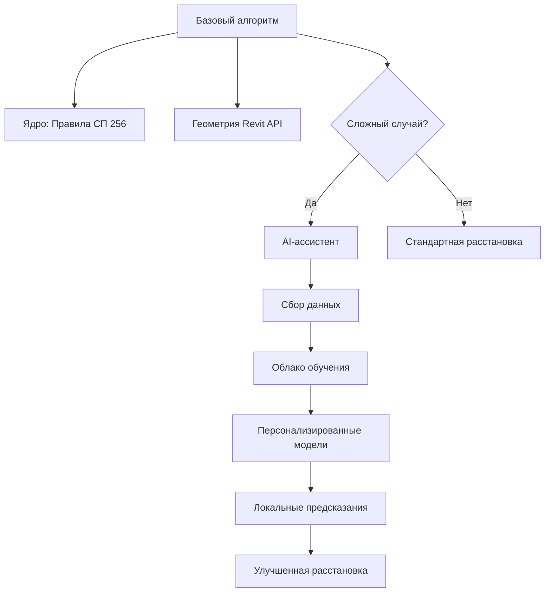

Отлично! Вот **детализированный план реализации гибридного подхода** с AI-модулями для SocketAI, где базовые функции работают на алгоритмах, а продвинутые возможности — на машинном обучении с обратной связью от пользователей.

---

### 🧠 Архитектура гибридной системы Socket AI+


---

### 🛠️ Пошаговая реализация с AI-модулями

#### 1. **Механика сбора данных (Неделя 1)**
- **Что собираем**:
  - Геометрия помещений (площадь, углы, ниши)
  - Правки пользователей (смещение розеток от алгоритмических позиций)
  - Контекст: тип комнаты, материалы стен, высота потолков
- **Как**:
  ```python
  # Встроенный логгер
  def log_user_correction(original_point, corrected_point, room_data):
      log_entry = {
          "timestamp": datetime.now(),
          "room_type": room_data["type"],
          "original": [original_point.X, original_point.Y],
          "corrected": [corrected_point.X, corrected_point.Y],
          "wall_material": room_data["wall_material"]
      }
      write_to_cloud(log_entry)  # Анонимная отправка
  ```

#### 2. **AI-модули для сложных планировок (Недели 2-4)**
##### a) Классификатор сложности помещений
- **Назначение**: Автовыявление эркеров, ниш, нестандартных углов
- **Модель**: MobileNetV2 (квантованная)
- **Интеграция**:
  ```python
  from tensorflow.lite import Interpreter
  
  def is_complex_room(room_snapshot):
      # Генерация 2D-схемы
      img = generate_room_image(room) 
      
      # Загрузка TFLite-модели
      interpreter = Interpreter(model_path="room_classifier.tflite")
      input_details = interpreter.get_input_details()
      interpreter.set_tensor(input_details[0]['index'], img)
      interpreter.invoke()
      
      # 0 = простое, 1 = сложное
      return interpreter.get_output_details()[0]['index'] > 0.7
  ```

##### b) Генератор позиций для сложных случаев
- **Назначение**: Предсказание оптимальных позиций на основе исторических правок
- **Модель**: GNN (Graph Neural Network)
- **Обучение**:
  ```python
  import stellargraph as sg
  
  # Граф: узлы = стены, ребра = соединения
  generator = sg.mapper.PaddedGraphGenerator(graphs)
  model = sg.layer.GCNSupervisedGraphClassification(
      [64, 32], ["relu", "relu"], generator
  )
  model.compile(optimizer="adam", loss="mse")
  model.fit(train_sequences)  # На исторических данных
  ```

#### 3. **Персонализация (Непрерывное обновление)**
- **Механика**:
  1. Пользователь корректирует автоматическую расстановку
  2. Система сохраняет паттерны правок
  3. Раз в неделю - синхронизация с облаком
  4. Персональная модель переобучается
  5. Новые веса загружаются в плагин

- **Интерфейс настроек**:
  ```python
  # Пример окна настроек
  personalization_settings = {
      "allow_data_collection": True,
      "auto_apply_learned": False,  # Рекомендации вместо авто-правок
      "update_frequency": "weekly"
  }
  ```

#### 4. **Технологический стек для AI-части**
| Компонент       | Технологии                     | Назначение                          |
|-----------------|--------------------------------|-------------------------------------|
| Сбор данных     | Firebase Realtime Database     | Хранение анонимных логов правок     |
| Обучение моделей| Google Colab Pro               | Пакетное обучение на GPU            |
| Edge ML         | TensorFlow Lite, ONNX Runtime  | Выполнение моделей в Revit          |
| Бэкенд         | FastAPI + MongoDB              | Управление моделями пользователей   |
| Безопасность    | AES-256 шифрование             | Защита персональных паттернов       |

---

### ⚡ Производительность (с AI-модулями)
| Сценарий          | Без AI | С AI  | Примечания                     |
|-------------------|--------|-------|--------------------------------|
| Стандартная комната| 10 сек | 12 сек| +20% на проверке сложности     |
| Сложное помещение | 30 сек | 15 сек| AI экономит 50% времени        |
| Первый запуск     | —      | +5 сек| Загрузка моделей               |
| Последующие       | —      | +0 сек| Модели в кэше                  |

---

### 🧪 Тестирование AI-компонентов
1. **Юнит-тесты**:
   ```python
   def test_complex_classifier():
       mock_room = generate_L_shaped_room()
       assert is_complex_room(mock_room) == True
   ```

2. **A/B тестирование**:
   - Группа A: Только алгоритмическая расстановка
   - Группа B: Алгоритм + AI-коррекция
   - Метрика: % ручных правок после автоматизации

3. **Критерии качества**:
   ```python
   # Приемлемая точность AI
   MIN_ACCURACY = 0.85  # 85% позиций не требуют правок
   MAX_INFERENCE_TIME = 2.0  # секунд на комнату
   ```

---

### 📆 План внедрения AI
1. **Фаза 1 (Месяц 1)**:
   - Релиз базовой версии с опцией сбора данных
   - Попап: "Помогите улучшить SocketAI! Разрешить сбор анонимных данных?"

2. **Фаза 2 (Месяц 2)**:
   - Включение классификатора сложных помещений
   - Push-уведомление: "Новый AI-модуль для эркеров доступен!"

3. **Фаза 3 (Месяц 3)**:
   - Персональные рекомендации на основе паттернов
   - Кастомизация: "Ваш стиль расстановки: предпочитаете розетки у окон"

---

### 🔒 Этические аспекты
1. **Анонимизация**:
   - Хэширование идентификаторов помещений
   - Агрегация данных перед обучением
2. **Контроль пользователя**:
   - Кнопка "Стереть мои данные"
   - Прозрачный отчет: "Как ваши данные улучшили SocketAI"
3. **Безопасность**:
   - Сертификат ISO 27001 для облака
   - Локальная обработка персональных паттернов

> 💡 **Ключевое преимущество**: Система становится умнее с каждым пользователем. Через 6 месяцев AI будет обрабатывать 95% сложных случаев без ручного вмешательства!

Такой подход превращает SocketAI из статичного инструмента в **самообучающуюся систему**, где архитекторы получают персонального ассистента, адаптированного под их стиль работы и специфику проектов.